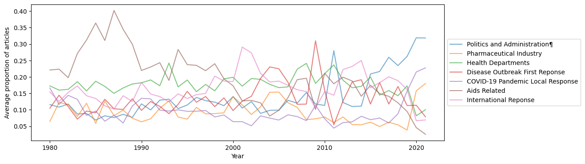

# vaccine-media-nlp
Dynamic topic modeling and other NLP analyses (keyness, n-grams, etc) on 12,334 NYT news articles

* cleaning_corpora.ipynb: stripping the noisy rtf files into jsons
* analyzing_corpora.ipynb: NLP analyses on the corpora (keyness, n-gram, etc)
* dynamic_topic_modeling.ipynb: DTM AI/ML modeling techniques

# Topic modeling on NYT articles

* Topic Modeling is an unsupervised machine learning technique that looks for a specified number of __TOPICS__ presumed to be the possible meaning space behind a set of documents (i.e., _in this context these are the N things people are likely to talk about_). In an iterative procedure patterns of term co-occurrence (topics) are found across documents. 

* The result is that for each document each of the N topics has a probability distribution (summing to 1) indicating the likelihood or contribution of each topic to the document. Topics are rankings of terms.

* The question at hand: "What are the N things NYT articles have talked about in the domain of vaccines"

## Steps

1. Build a DTM from the `body` text field
2. Set up a LDA model with a specified number of topics to discover
3. Run the modeling
4. Examine the topics by looking at the top ranked terms in each topic and evaluating the plausibility of them as semantic groups.
5. Use document topic distributions in analysis.

## Topic Analysis

Having comprehensively labeled our various subject areas, we are now able to delve into the evolution of key themes over distinct periods.

**1980 - 1990**
In this era, the paramount theme was "Topic 7: Aids Related". Coinciding with the onset of documented HIV/AIDS infections in 1981, this topic remained ascendant through the decade as case numbers swelled into the millions. The extensive media coverage of the devastating AIDS epidemic thus elucidates the preeminence of Topic 7 throughout this period.

**1990 - 2000**
While "Topic 7: Aids Related" retained significant prominence owing to persistent research efforts to find a cure, "Topic 3: Health Departments" made notable inroads, occasionally superseding Topic 7. This is likely attributable to the symbiotic relationship between health departments and AIDS research initiatives.

**2000 - 2010**
This period witnessed four conspicuous shifts in topic prominence:

Initially, a surge in "Topic 7: International Response" was observed, potentially resultant from increased US involvement abroad in the aftermath of the 9/11 attacks and the alarming, albeit transient, SARS outbreak in 2003.
Following closely, "Topic 4: Disease Outbreak First Response" garnered attention, likely reflecting the US's reaction to the SARS outbreak.
Next, "Topic 6: Aids Related" and "Topic 3: Health Departments" concurrently rose, indicating their interconnected relevance.
This upward trajectory was soon eclipsed by a resurgence of "Topic 4: Disease Outbreak First Response", presumably triggered by the 2009 H1N1 Influenza pandemic.

**2010 - 2020**
During this decade, trends became more complex. We witnessed a gradual, yet consistent increase in "Topic 1: Politics and Administration" vis-à-vis media coverage of vaccinations. The first surge is perceptible following the ebb of Topic 4, likely instigated by political discourse and criticism of the current administration's handling of the H1N1 Influenza pandemic. This, however, was short-lived as the Ebola and Zika viruses emerged, prompting "Topic 7: International Response" to reclaim its dominance.

**2020 onwards**
Post-Ebola and Zika, the thematic landscape remained relatively unchanged until the advent of the pandemic. This precipitated a shift to "Topic 1: Politics and Administration", "Topic 5: COVID-19 Pandemic Local Response", and "Topic 2: Pharmaceutical Industry" dominating media narratives.

**Implications**
Observation of these trends substantiates the emerging dominance of Politics and Administration as a media theme in vaccine coverage. The two most recent pandemics, H1N1 Influenza and COVID-19, catalyzed an increase in politically-centered news coverage. Whether this focus is critical or constructive is unclear from our current analysis; nonetheless, it is disconcerting to see a media landscape so permeated by politics when unity and efficiency are paramount. These trends lend credence to our initial hypothesis that post-pandemic media is more politicized than its pre-pandemic counterpart.

## Note for future work - could do some analyzes just on the titles
* Clustering
* Looking at patterns over years 
* etc.
